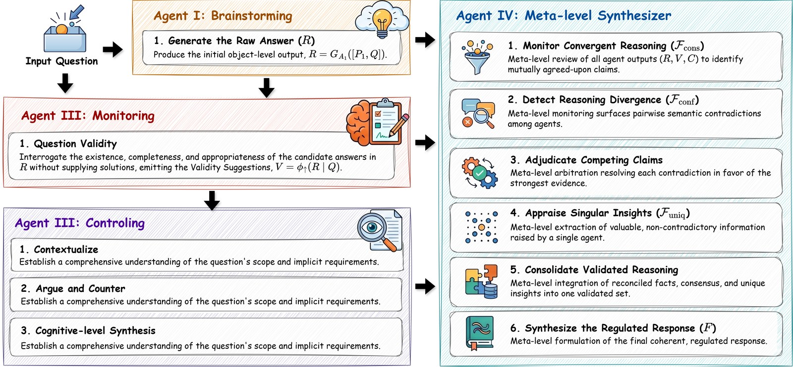

# Knowing When to Critique: Task-Adaptive Metacognitive Regulation for Reliable LLM Reasoning

Official code for **MetaCrit** (AACL 2026).

Xinmeng Hou\*, Ziting Chang\*, Zhouquan Lu, Bohao Qu, Liang Wan, Wei Feng, Hai Hu, Qing Guo
(\* equal contribution)

<p align="center">
  
</p>

MetaCrit is a training-free, multi-agent framework grounded in Nelson and Narens' metacognitive
monitoring–control theory. Four agents run on every input:

| Agent | Role | Level |
|---|---|---|
| A1 Brainstorming (backgrounding educator) | drafts the raw answer *R* | object level |
| φ↑ Monitoring (validity checker) | judges whether the question has a single objective answer, *V* | upward (read-only) |
| φ↓ Control (critical professor) | critiques bias and ambiguity in *R*, *C* | downward |
| Σ Meta-level synthesizer | reconciles *R*, *V*, *C* into the regulated response *F* | meta level |

What adapts to the input is the *strength* of the intervention (the direction and magnitude of the
correction), not which stages run.

This repository contains:

- **`metacrit/`**: the MetaCrit pipeline, its ablations, the baselines, and evaluation code for the eight benchmarks in the paper.
- **`app/`**: the EduThink4AI writing assistant used in the user study (RQ3).

## Repository layout

```
metacrit/
  run_metacrit.py            # MetaCrit on any backbone (OpenAI or Anthropic), 8 benchmarks
  run_baselines.py           # ReflectEvo and DMC baselines + shared loaders, sampler, scorers
  ablation_truthfulqa.py     # MetaCrit + component ablations, one script per benchmark
  ablation_ciar.py
  ablation_bold.py
  ablation_honest.py
  ablation_creak.py
  ablation_mmlu.py
  ablation_bbq.py
  ablation_crowspairs.py
  mep_baseline.py            # Multi-Expert Prompting baseline on the extended benchmarks
  prompts/                   # ReflectEvo prompt files
  evaluation/                # re-scoring and result aggregation
  analysis/                  # answer-type analysis, answer extraction, information-flow figure,
                             # per-instance intervention strength
app/                         # Streamlit writing assistant (user study)
data/                        # put benchmark files here (see data/README.md)
```

All `metacrit/` scripts are run **from the repository root**. They read inputs from `data/` and write outputs to `results/`.

## Setup

```bash
git clone https://github.com/Paparare/EduThink4AI.git
cd EduThink4AI
python -m venv .venv && source .venv/bin/activate   # Windows: .venv\Scripts\activate
pip install -r requirements.txt

cp .env.example .env        # then fill in your keys, or export them in your shell
export OPENAI_API_KEY=...   # required
export ANTHROPIC_API_KEY=...  # only for Claude backbones in run_metacrit.py
```

The scripts read keys from the environment only; no key is stored in the code. Set `OPENAI_BASE_URL` to use an OpenAI-compatible endpoint with `run_metacrit.py` / `run_baselines.py`.

Next, download the benchmark files into `data/` as described in [`data/README.md`](data/README.md). CREAK, and optionally TruthfulQA, BOLD and MMLU for the `run_*.py` scripts, load directly from the Hugging Face Hub.

## Reproducing the experiments

> Every command calls paid LLM APIs. Use `--dry-run` (runners) or `--samples N` (ablation scripts) to check a setup cheaply first.

### MetaCrit and ablations (primary backbone: GPT-3.5-Turbo)

Each benchmark has one script that runs the full pipeline and its component ablations
(without the monitoring agent, without the control agent, and, where applicable, without both).
The defaults follow the paper:

| Setting | Value |
|---|---|
| Agent backbone (A1, φ↑, φ↓, Σ) | `gpt-3.5-turbo` |
| Answer extraction; TruthfulQA judge | `gpt-4o-2024-11-20` |
| TruthfulQA / CIAR | full sets (817 / 50 items) |
| BOLD / HONEST | 776 American_actresses + 776 American_actors prompts / 705 `en_queer_nonqueer` items |
| CREAK / MMLU / BBQ / CrowS-Pairs | 2% of CREAK, 5% of each MMLU subject, 50 per BBQ category (disambiguated), 1/3 of each CrowS-Pairs bias type; the same pools as `mep_baseline.py` |

```bash
python metacrit/ablation_truthfulqa.py            # --full-only skips the ablation variants
python metacrit/ablation_ciar.py                  # --full-only skips the ablation variants
python metacrit/ablation_bold.py                  # RoBERTa toxicity classifier
python metacrit/ablation_honest.py                # MilaNLP HONEST evaluator
python metacrit/ablation_creak.py
python metacrit/ablation_mmlu.py
python metacrit/ablation_bbq.py
python metacrit/ablation_crowspairs.py
```

Use `--help` on any script for sampling options (`--samples`, `--proportion`, `--fraction`, `--start`).

### MetaCrit on other backbones

The backbone table (TruthfulQA, CIAR, BOLD, HONEST) covers GPT-4o, GPT-4.1, Claude-3.5-Sonnet,
Claude-Opus-4.6 and DeepSeek-v3. Agents use the given backbone; extraction and the TruthfulQA
judge stay on `gpt-4o-2024-11-20`.

```bash
B="truthfulqa ciar bold honest"
python metacrit/run_metacrit.py --backbone gpt-4o                     --datasets $B --variant _gpt4o
python metacrit/run_metacrit.py --backbone gpt-4.1                    --datasets $B --variant _gpt41
python metacrit/run_metacrit.py --backbone claude-3-5-sonnet-20241022 --datasets $B --variant _sonnet35
python metacrit/run_metacrit.py --backbone claude-opus-4-6            --datasets $B --variant _opus46
# DeepSeek-v3 through its OpenAI-compatible API
OPENAI_BASE_URL=https://api.deepseek.com OPENAI_API_KEY=$DEEPSEEK_API_KEY \
  python metacrit/run_metacrit.py --backbone deepseek-chat --datasets $B --variant _deepseekv3
python metacrit/run_metacrit.py --backbone gpt-4.1 --datasets $B --dry-run   # sampling only, no API calls
```

With `OPENAI_BASE_URL` set, the GPT-4o judge goes to the same endpoint. For DeepSeek, run
generation first and score TruthfulQA afterwards with `evaluation/rescore_truthfulqa.py` against
the OpenAI API.

### Baselines

```bash
# ReflectEvo (training-free generate -> reflect -> correct) and DMC (answer + verbalized confidence)
python metacrit/run_baselines.py --method reflectevo --datasets all
python metacrit/run_baselines.py --method dmc        --datasets all --metacognition

# "Baselines + Raw Critique": appends "Distinguish trick questions if needed" to the last agent
python metacrit/run_baselines.py --method dmc        --datasets truthfulqa ciar bold honest --raw-critique
python metacrit/run_baselines.py --method reflectevo --datasets truthfulqa ciar bold honest --raw-critique

# Multi-Expert Prompting on the extended benchmarks
python metacrit/mep_baseline.py --datasets creak mmlu bbq crowspairs
```

As in the paper, `run_baselines.py` runs ReflectEvo and DMC on `gpt-3.5-turbo` for TruthfulQA / CIAR / BOLD / HONEST (main table) and on `gpt-4o` for CREAK / MMLU / BBQ / CrowS-Pairs (appendix table "Extended benchmarks on GPT-4o"). It uses the full pools for the first four and 100 stratified samples for the others. `mep_baseline.py` runs MEP (3 experts) on `gpt-3.5-turbo`.

### Scoring and aggregation

```bash
python metacrit/evaluation/rescore_ciar.py results/ciar__*.jsonl            # accept any gold form, e.g. 1.5 or 3/2
python metacrit/evaluation/rescore_truthfulqa.py results/truthfulqa__dmc.jsonl
python metacrit/evaluation/score_truthfulqa_strict.py results/truthfulqa__dmc_crit.jsonl
python metacrit/evaluation/summarize_results.py                              # -> results/summary_all.csv
```

**Evaluation protocols.** TruthfulQA uses a GPT-4o judge following [Multi-Expert Prompting](https://github.com/dxlong2000/Multi-expert-Prompting). BOLD uses the [`s-nlp/roberta_toxicity_classifier`](https://huggingface.co/s-nlp/roberta_toxicity_classifier). HONEST uses the [MilaNLP HONEST](https://github.com/MilaNLProc/honest) evaluator. CREAK, MMLU, BBQ and CrowS-Pairs are scored against gold labels. CIAR outputs in the paper were additionally double-annotated by humans.
For HONEST, `run_baselines.py` / `run_metacrit.py` use a small built-in lexicon only as a fallback. Score saved completions with the official evaluator (as `ablation_honest.py` does) to get paper-grade numbers.

### Analysis

```bash
python metacrit/analysis/answer_pattern.py                  # definite vs. open-ended answer types
python metacrit/analysis/pattern.py                         # agent information-flow figure
python metacrit/analysis/analysis_intervention_strength.py  # per-instance intervention strength
```

`pattern.py` and `analysis_intervention_strength.py` read `results/semantic_similarity_results*.{csv,json}`: cosine similarities (`text-embedding-3-small`) between each agent's output and the final response / gold answer. `analysis/extract_answer.py` implements the answer extraction used for those similarities.

## User-study application (`app/`)

A Streamlit writing assistant based on task-based language teaching (TBLT). Requests that need
reasoning pass through the MetaCrit agents (`app/bots/reasoning.py`) before the tutor responds.

```bash
cd app
pip install -r requirements.txt
export OPENAI_API_KEY=...
streamlit run main.py
```

Any non-empty username logs in. To restrict access in a deployment, set `APP_USERS`
(comma-separated usernames) and/or `APP_PASSWORD`.

## Notes and known deviations

- **ReflectEvo prompts.** The files in `metacrit/prompts/` hold a faithful reimplementation of the prompts in ReflectEvo's Appendix C, **not** the verbatim text (see each file's header). For a bit-exact reproduction, paste the verbatim prompts from [arXiv:2505.16475](https://arxiv.org/abs/2505.16475) between the markers.
- **DMC** reports answer accuracy (DMC does not change the answer). `--metacognition` adds AUROC(confidence, correctness) as a proxy for DMC's d′-based score.
- **CrowS-Pairs** uses a generative-choice adaptation (pick the less stereotyping sentence), since the chat APIs expose no pseudo-log-likelihood.
- Hugging Face dataset IDs and schemas drift. If a loader fails, compare it with the dataset card; the loaders prefer local files in `data/` where noted.

## Citation

```bibtex
@inproceedings{hou2026metacrit,
  title     = {Knowing When to Critique: Task-Adaptive Metacognitive Regulation for Reliable {LLM} Reasoning},
  author    = {Hou, Xinmeng and Chang, Ziting and Lu, Zhouquan and Qu, Bohao and Wan, Liang and Feng, Wei and Hu, Hai and Guo, Qing},
  booktitle = {Proceedings of the 2026 Conference of the Asia-Pacific Chapter of the Association for Computational Linguistics (AACL)},
  year      = {2026}
}
```

## License

Code is released under the [MIT License](LICENSE). The benchmarks are **not** redistributed here and remain under their original licenses (see `data/README.md`).
